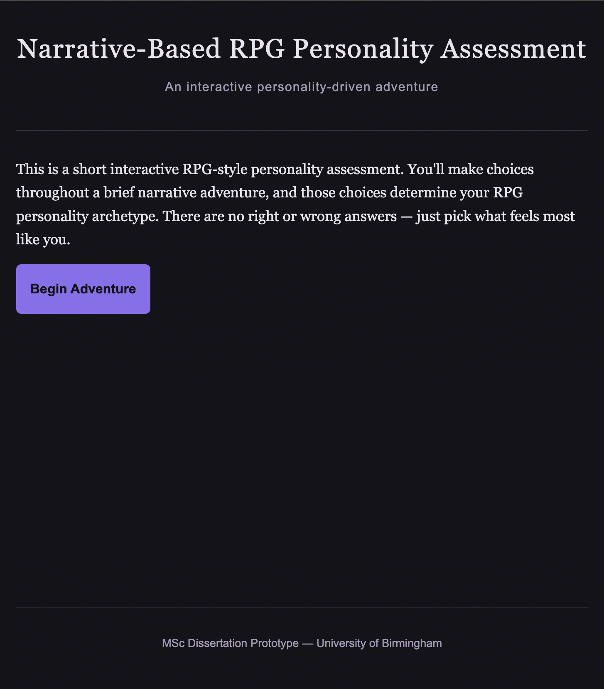
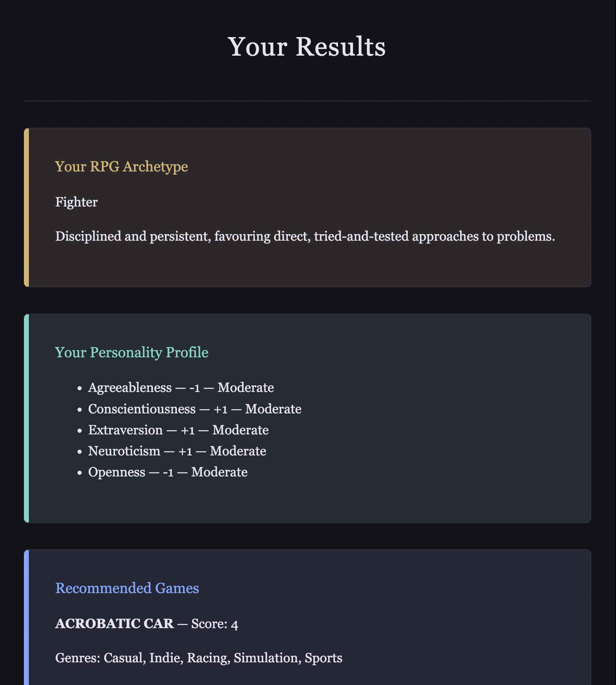
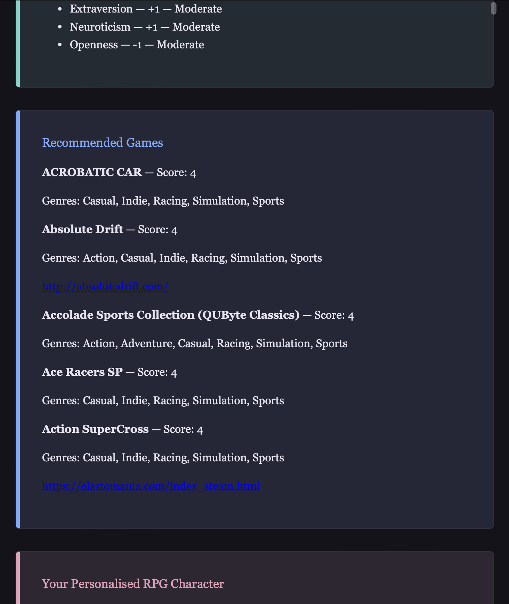
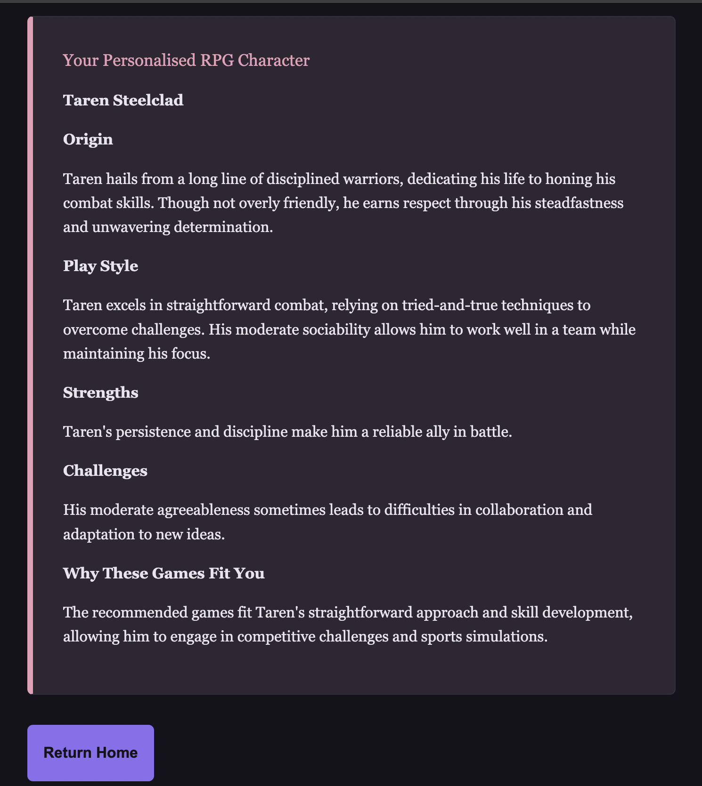

# Narrative-Based RPG Personality Assessment and Game Recommendation System

An MSc Computer Science dissertation project (University of Birmingham) exploring personality-informed RPG game recommendation through an interactive narrative experience.

Instead of a traditional personality questionnaire, users progress through an interactive branching fantasy narrative where their choices quietly reveal their Big Five personality traits. Based on these traits, the system recommends an RPG character archetype, generates a unique personalised character profile using an LLM, and suggests RPG games that match their playstyle.

## Project Objectives

- Assess personality through an interactive branching fantasy narrative.
- Map inferred Big Five personality traits to RPG character archetypes.
- Generate personalised RPG character profiles using an LLM.
- Recommend RPG games based on personality and playstyle.
- Evaluate the usability and perceived relevance of the system through a user study.

## Technologies

### Frontend
- HTML5
- CSS3
- Jinja2 templates

### Backend
- Python
- Flask
- Gunicorn

### AI Integration
- OpenAI API 

### Data
- CSV-based game dataset
- JSON-based narrative data

### Development Tools
- Visual Studio Code

### Deployment
The application was deployed using Railway with Gunicorn as the production WSGI server. The deployed version was used during the user evaluation study. The deployment is no longer active.

## System Features

### Interactive Narrative

Users progress through a branching fantasy narrative and make choices at different stages. The choices contribute to the assessment of five Big Five personality dimensions:

- Openness
- Conscientiousness
- Extraversion
- Agreeableness
- Neuroticism

There are no right or wrong answers. The system is designed so that users select the options that best reflect how they would approach each situation.

### RPG Personality Archetype

The personality scores generated from the narrative are interpreted to assign the user an RPG character archetype. The results page presents the assigned archetype together with a description of the associated personality profile.

### Game Recommendations

The system uses the inferred personality profile to generate RPG game recommendations from the available game dataset.

Recommendations can include personality-based scores. If no positive-scoring recommendations are available for a particular profile, the system uses a deterministic fallback mechanism to provide alternative games rather than returning an empty result.

### Personalised RPG Character

The system uses the user's personality profile and recommended games as context for an OpenAI-powered character generation component.

The generated character profile includes:

- Character name
- Origin
- Play Style
- Strengths
- Challenges
- Why the recommended games fit the character

### Configuration

The OpenAI API key is supplied through an environment variable and is not stored in the source code. A local `.env` file can be used for development and should not be committed to version control.

## How It Works

1. The user begins an interactive branching narrative.
2. Narrative choices contribute to Big Five personality scores.
3. The resulting personality profile is mapped to an RPG archetype.
4. The system uses the personality profile and playstyle to generate game recommendations.
5. The user's profile and recommendations are passed to the LLM to generate a personalised RPG character.
6. The results are presented together on the results page.

## Evaluation

The system was evaluated through a user study involving 32 participants. The evaluation examined usability, enjoyment, perceived personality/archetype fit, game recommendation relevance, and the personalisation of the LLM-generated character.

Across 18 five-point Likert-scale statements, the overall descriptive mean was 4.26/5.

## Screenshots

### Homepage

### Interactive Narrative

### Results

